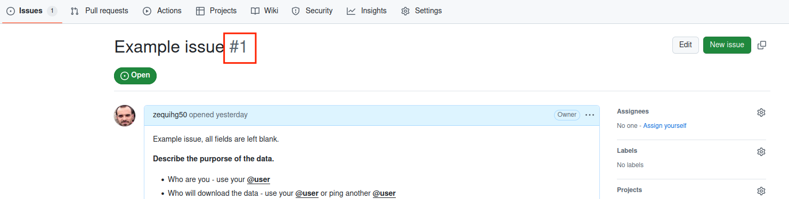

# ESGF data management

Data management for ESGF.

If you want to download data, fill a [request for ESGF data](https://github.com/zequihg50/esgf-data/issues/new?template=esgf-data-request-template.md). If you need help with the tools to download data (such as esgf-download), just open a [regular issue](https://github.com/zequihg50/esgf-data/issues/new).

## FAQ

### How can I download data from ESGF?

ESGF offers several mechanisms to download data:

- [wget scripts](https://esgf.github.io/esgf-user-support/metagrid.html#metagrid-faq)
- [esgf-download](https://github.com/ESGF/esgf-download) (aka [esgf-pull](https://esgf.github.io/esgf-download/))

You may develop your own solution based on the [search API](https://esgf.github.io/esg-search/ESGF_Search_RESTful_API.html).

### How do I keep track of scripts that download data?

Create a folder/directory under `data-issues` whose name is the ID of the [request for ESGF data issue](https://github.com/zequihg50/esgf-data/issues/new?template=esgf-data-request-template.md). That folder will contain scripts needed to download/process data. The `issue id` can be found next to the issue's title.

### What is the ESGF DRS?

DRS stands for Data Reference Syntax and it defines the directory/folder structure that files should follow in the file system. This is not mandatory if you are using your data for personal purposes but it is highly recommended to follow it in any download.

If you have some data that has been downloaded without following the DRS and you want to organize it accordingly, you may use [esgdrs](https://esgf.github.io/esgf-prepare/drs.html).
